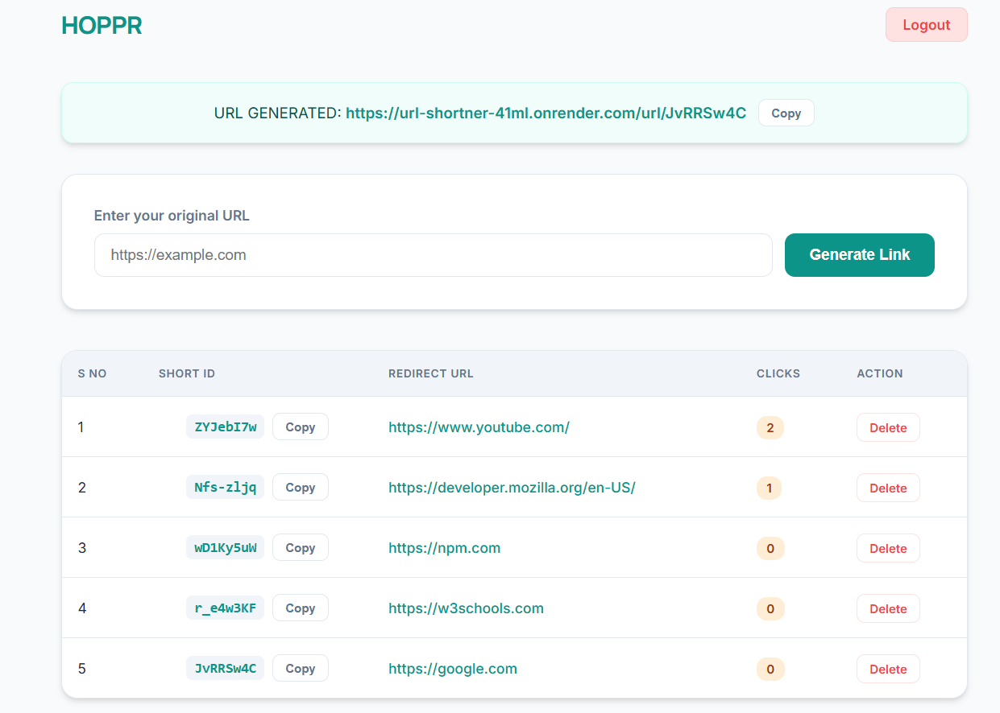

# 🔗 Hoppr - Premium URL Shortener

A high-performance, minimalist URL shortening service built with Node.js, Express, and MongoDB. Featuring a sleek teal-and-peach aesthetic, robust authentication, and real-time click tracking.



## ✨ Features

- **🚀 Instant Generation**: Convert long, messy URLs into concise, shareable links.
- **📊 Click Analytics**: Track total visits for every link created.
- **🔒 Secure Authentication**: JWT-based login and signup system with automatic secure logout.
- **🎨 Minimalist UI**: Professional Teal/Peach light theme with a glassmorphic aesthetic.
- **📱 Fully Responsive**: Optimized for desktop and mobile, showing domain-only results on small screens.
- **📋 One-Click Copy**: Integrated copy-to-clipboard buttons for all generated links.
- **🛡️ Cache Control**: Advanced logout mechanisms to prevent unauthorized access via browser cache.

## 🛠️ Tech Stack

- **Backend**: [Node.js](https://nodejs.org/) & [Express.js](https://expressjs.com/)
- **Database**: [MongoDB](https://www.mongodb.com/) (using Mongoose ODM)
- **Frontend**: [EJS](https://ejs.co/) (Embedded JavaScript templates)
- **Styling**: Vanilla CSS (Modern, Responsive, Minimalist)
- **Security**: JSON Web Tokens (JWT) & Cookie-based sessions

## 🚀 Getting Started

### 1. Clone the repository
```bash
git clone https://github.com/yourusername/Hoppr.git
cd hoppr
```

### 2. Install dependencies
```bash
npm install
```

### 3. Setup Environment Variables
Create a `.env` file in the root directory and add the following:
```env
PORT=3000
MONGODB_URI=your_mongodb_connection_string
SECRET_KEY=your_jwt_secret_key
```

### 4. Run the application
```bash
npm start
```

## 📁 Project Structure

```bash
├── controllers/    # Request handlers & logic
├── middleware/     # Auth & route guards
├── models/         # MongoDB schemas (URL, User)
├── routes/         # API & static viewpoints
├── service/        # JWT & logic helpers
├── views/          # EJS templates (Home, Login, Signup)
└── index.js        # Main entry point
```

## 🔐 Security & UX Features

- **Logout on Refresh**: Enhanced security to clear sessions on page reload or back-navigation.
- **Responsive Table**: Redirect URLs intelligently collapse to hostnames on mobile devices.
- **JWT Protection**: Middleware ensures only authorized users can view and create links.

## 📄 License

This project is licensed under the MIT License - see the [LICENSE](LICENSE) file for details.

---
Built with ❤️ by [Pushkar](https://github.com/pushkar)
